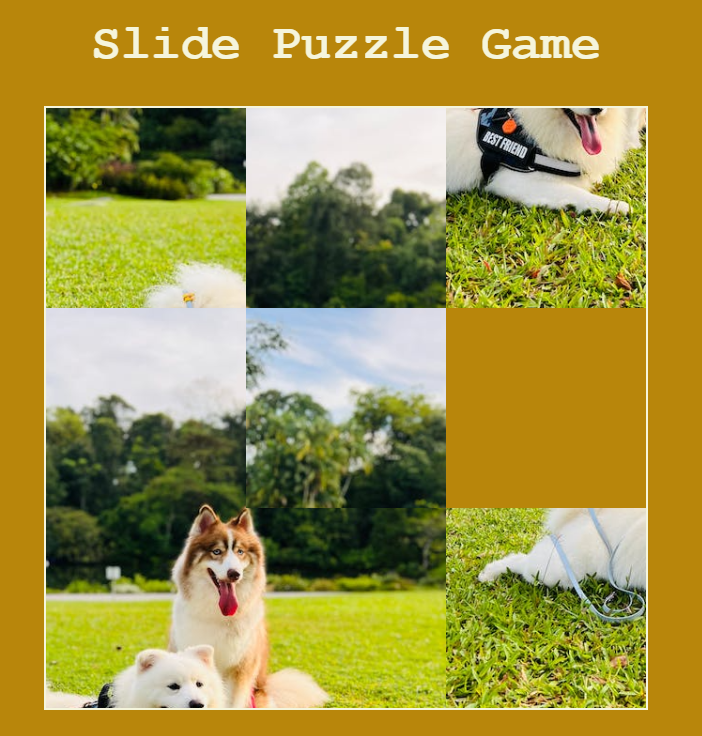

# Sliding-Block-Puzzle

This project offers a classic sliding block puzzle experience right in your browser. Move the blocks to their correct positions and solve the puzzle by sliding them around the grid.

<!--  -->

## Table of Contents

- [Description](#description)
- [Main Functionalities](#main-functionalities)
- [Backlog Functionalities](#backlog-functionalities)
- [Technologies Used](#technologies-used)
- [Features](#features)
- [Game Rules](#game-rules)
- [Play the Game :rocket:](PASTE_URL)
- [Usage in local](#usage-in-local)
- [Installation in local](#installation-in-local)
- [Backlog Functionalities](#backlog-functionalities)
- [Project Structure](#project-structure)

- [Reference](#reference)

## Description

This project offers a classic sliding block puzzle experience right in your browser. Move the blocks to their correct positions and solve the puzzle by sliding them around the grid.

## Main Functionalities

- The game is a classic sliding block puzzle where players need to rearrange the pieces of an image to complete the original picture.
- Players interact with the puzzle by clicking on puzzle pieces to move them.
- Users can choose the image they want to use for the puzzle, allowing for customization.
- Puzzle pieces are randomly shuffled at the start of the game, providing a challenging starting point.
- The game checks whether the shuffled puzzle is solvable, ensuring that players can complete it.
- Players receive congratulatory message when they successfully complete the puzzle.

## Backlog Functionalities

- Adding total number of clicks count button
- Adding countdown timer button
- Adding congratulatory message with confetti

## Technologies Used

- HTML
- JavaScript
- DOM Manipulation
- JS Canvas

## Features

- Puzzle image can be customized.
- Interactive user interface with canvas rendering.
- Random shuffling of puzzle pieces to start the game.
- Validation to check if the puzzle is solvable.

## Game Rules

- Click on a puzzle piece to move it to the adjacent empty slot.
- Rearrange the pieces to recreate the original image.
- The game is considered solved when the puzzle is fully reassembled.

## Usage in local

1. Open the `index.html` file in a web browser to start the game.
2. Click on the puzzle pieces to move them.
3. Rearrange the pieces to complete the puzzle.

## Installation in local

1. Clone the repository to your local machine.
2. Open the project directory.
3. Open the index.html with live Server _[Right click --> Open with Live Server]_
4. This should open the puzzle in the default browser

## Project Structure

### script.js

- class Board
  - this.rowCols;
  - this.width;
  - this.height;
- cutImageIntoPieces()
- shuffle()
- isSolvable()
- drawAllTiles()
- getRowColFromIndex()
- move()
- getMouseCoords()
- findBlankIndex()
- hasBlankNeighbour()
- getIndexFromCoords()
- swapIndex()
- isSolved()
- drawLastTile()

## Reference

- [JS Project - Sliding Puzzle with Vanilla JS & Canvas API | Part 1 ](https://www.youtube.com/watch?v=g7nufIhA15M)
- [JS Project - Sliding Puzzle with Vanilla JS & Canvas API | Part 2 ](https://www.youtube.com/watch?v=hsH-a_vKnFo)

## Links

- Slides Link
- Github repository Link
- Deployment Link
